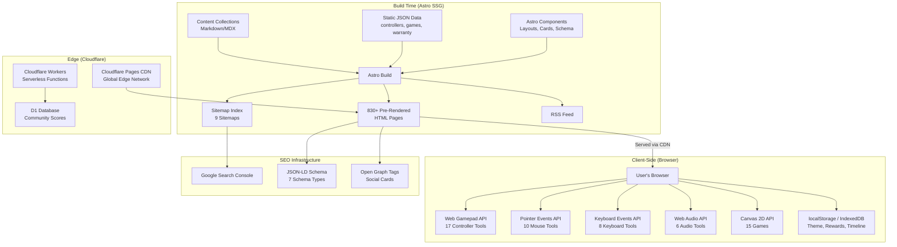
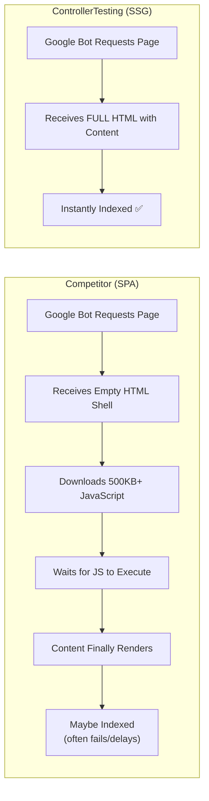
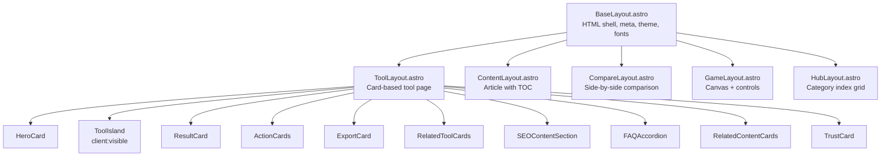
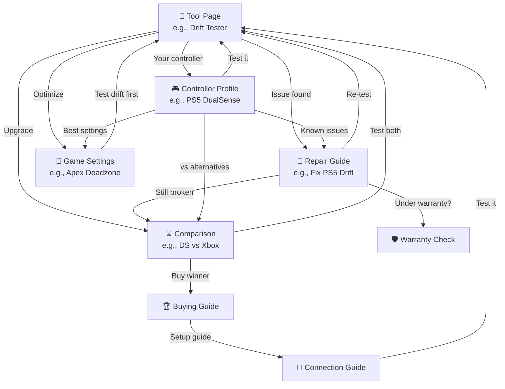
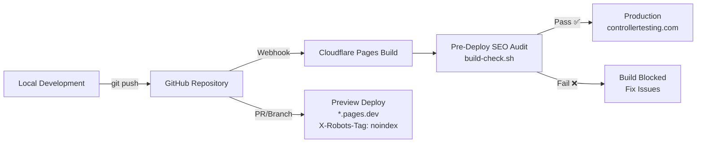

# Architecture Document: ControllerTesting.com
## SEO-First Astro.js Gaming Tools Hub

---

## 1. System Overview



### Core Principles

| Principle | Implementation | Rationale |
|---|---|---|
| **SEO-First** | SSG pre-rendered HTML, one URL per tool/page, schema markup | 830+ indexed pages vs competitors' <10 |
| **Static-First** | Zero server required for core functionality | Eliminates hosting costs, maximizes uptime |
| **Privacy-First** | All testing runs in browser, data stays in localStorage | Trust signal, GDPR compliance |
| **Performance-First** | <250KB per page, <2s LCP, CLS=0 | Core Web Vitals ranking advantage |

### Technology Choices

| Layer | Choice | Rationale |
|---|---|---|
| **SSG Framework** | Astro 5.x | Islands architecture = zero JS on content pages, full JS on tool pages. Best of both worlds for SEO + interactivity. |
| **Interactive Tools** | Vanilla JS (Astro islands) | No framework overhead. Tools are self-contained. `client:visible` lazy-loads only when scrolled into view. |
| **Styling** | Vanilla CSS Custom Properties | Maximum performance (<30KB CSS), theme support via tokens, no build dependency. |
| **Hosting** | Cloudflare Pages | Edge-deployed to 300+ PoPs, <200ms TTFB globally, free tier covers initial traffic. |
| **Community Data** | Cloudflare Workers + D1 | Serverless, globally distributed, SQLite-compatible, auto-scales. |
| **Analytics** | Plausible Analytics | Privacy-first, GDPR-compliant, lightweight (<1KB script). |

---

## 2. Rendering Strategy

### Why SSG Destroys SPAs for SEO



| Metric | Competitors (SPA) | ControllerTesting (SSG) |
|---|---|---|
| HTML response | Empty `<div id="root"></div>` | Full content, 830+ unique pages |
| JS required for content | 500KB+ mandatory | 0KB for content pages |
| Google indexing | Delayed, often partial | Instant, complete |
| Indexed pages | 5-30 | 830+ |

### Islands Architecture

```
Content Page (repair guide):        Tool Page (drift tester):
┌──────────────────────┐            ┌──────────────────────┐
│ Static HTML (SSG)    │            │ Static HTML (SSG)    │
│ - Header             │            │ - Header             │
│ - Breadcrumbs        │            │ - Breadcrumbs        │
│ - Article Content    │            │ - Tool Description   │
│ - FAQ Accordion      │            │ ┌──────────────────┐ │
│ - Related Links      │            │ │ INTERACTIVE      │ │
│ - Footer             │            │ │ ISLAND           │ │
│                      │            │ │ client:visible   │ │
│ JavaScript: 0 KB ✅  │            │ │ DriftTester.js   │ │
│                      │            │ │ ~25KB            │ │
└──────────────────────┘            │ └──────────────────┘ │
                                    │ - Results Section    │
                                    │ - SEO Content        │
                                    │ - Footer             │
                                    │                      │
                                    │ JS: ~25KB (lazy) ✅   │
                                    └──────────────────────┘
```

**Hydration directives**:
- `client:visible` — Tool components (loads when scrolled into view)
- `client:idle` — Theme toggle, nav menu (loads after page is idle)
- `client:load` — Nothing uses this (we never need immediate hydration)
- No directive — Content pages (zero JavaScript shipped)

---

## 3. URL Architecture & Routing

### Complete URL Map

```
controllertesting.com/
│
├── /                                    ← Homepage (static + hero tool island)
│
├── /test/
│   ├── /test/controller/               ← Controller tools hub index
│   │   ├── /test/controller/drift       ← 17 individual tool pages
│   │   ├── /test/controller/buttons
│   │   ├── /test/controller/triggers
│   │   ├── /test/controller/vibration
│   │   ├── /test/controller/circularity
│   │   ├── /test/controller/deadzone
│   │   ├── /test/controller/polling-rate
│   │   ├── /test/controller/latency
│   │   ├── /test/controller/dpad
│   │   ├── /test/controller/full-diagnostic
│   │   ├── /test/controller/health-score
│   │   ├── /test/controller/timeline
│   │   ├── /test/controller/gyroscope
│   │   ├── /test/controller/touchpad
│   │   ├── /test/controller/microphone
│   │   ├── /test/controller/multi
│   │   └── /test/controller/competitive-readiness
│   │
│   ├── /test/mouse/                    ← 10 mouse tools
│   ├── /test/keyboard/                 ← 8 keyboard tools
│   ├── /test/audio/                    ← 6 audio tools
│   └── /test/performance/              ← 5 performance tools
│
├── /tools/                              ← 8 gaming utilities
│   ├── /tools/sensitivity-converter
│   ├── /tools/fov-calculator
│   ├── /tools/crosshair-generator
│   └── ...
│
├── /games/                              ← 15 games + hub
│   ├── /games/stick-maze
│   ├── /games/pong
│   ├── /games/leaderboard
│   └── ...
│
├── /controllers/[slug]                  ← 35+ profiles (content collection)
├── /fix/[category]/[slug]               ← 60+ repair guides
├── /settings/[game]/[controller]        ← 100+ game settings (programmatic)
├── /compare/[slug]                      ← 80+ comparisons (programmatic)
├── /connect/[controller]/[platform]     ← 80+ connection guides (programmatic)
├── /best/[slug]                         ← 30+ buying guides
├── /data/[report]                       ← 15+ community data pages
├── /learn/[slug]                        ← 25+ educational articles
│
├── /warranty                            ← Warranty assistant
├── /fix-or-replace                      ← Calculator
├── /rewards/shop                        ← Cosmetic shop
├── /rewards/achievements                ← Achievement display
│
├── /about                               ← Methodology & trust
├── /privacy                             ← Privacy policy
├── /terms                               ← Terms of service
└── /404                                 ← Custom 404
```

### URL Rules
- **Trailing slash**: NEVER (`trailingSlash: 'never'` in astro.config)
- **Canonical**: Self-referencing on every page
- **Protocol**: HTTPS only (redirect HTTP → HTTPS)
- **Subdomain**: No www (redirect www → non-www)
- **Case**: All lowercase, hyphens for separators

---

## 4. Component Architecture

### Layout Hierarchy



### Component Directory

```
src/components/
├── global/          ← Appears on every page
│   ├── Header.astro
│   ├── Footer.astro
│   ├── Breadcrumbs.astro
│   ├── ThemeToggle.astro
│   └── SEOHead.astro
│
├── cards/           ← Reusable card patterns
│   ├── ToolCard.astro
│   ├── ResultCard.astro
│   ├── ActionCard.astro
│   ├── ContentCard.astro
│   ├── ControllerCard.astro
│   ├── ExportCard.astro
│   ├── TrustCard.astro
│   ├── GameCard.astro
│   ├── AchievementCard.astro
│   └── RewardCard.astro
│
├── tools/           ← Interactive islands (client-side JS)
│   ├── controller/  ← 17 controller tool components
│   ├── mouse/       ← 10 mouse tool components
│   ├── keyboard/    ← 8 keyboard tool components
│   ├── audio/       ← 6 audio tool components
│   └── performance/ ← 5 performance tool components
│
├── games/           ← Game components (Canvas 2D)
│
├── schema/          ← JSON-LD generators
│   ├── WebAppSchema.astro
│   ├── HowToSchema.astro
│   ├── ProductSchema.astro
│   ├── FAQSchema.astro
│   ├── BreadcrumbSchema.astro
│   ├── VideoGameSchema.astro
│   └── ItemListSchema.astro
│
└── ui/              ← Reusable primitives
    ├── Button.astro
    ├── Badge.astro
    ├── ProgressBar.astro
    ├── Gauge.astro
    ├── Slider.astro
    ├── Accordion.astro
    ├── Modal.astro
    └── Toast.astro
```

---

## 5. Data Architecture

### Content Collections (Astro)

```typescript
// src/content/config.ts
import { defineCollection, z } from 'astro:content';

const controllers = defineCollection({
  type: 'content',
  schema: z.object({
    name: z.string(),
    manufacturer: z.string(),
    type: z.enum(['playstation', 'xbox', 'nintendo', 'pc', 'third-party']),
    image: z.string(),
    releaseDate: z.string(),
    price: z.number(),
    warranty: z.string(),
    knownIssues: z.array(z.string()),
    features: z.object({
      gyroscope: z.boolean(),
      touchpad: z.boolean(),
      adaptiveTriggers: z.boolean(),
      hapticFeedback: z.boolean(),
    }),
  }),
});

const fix = defineCollection({
  type: 'content',
  schema: z.object({
    title: z.string(),
    controller: z.string(),
    category: z.enum(['stick-drift', 'not-connecting', 'trigger-issues', 'button-stuck', 'vibration-not-working', 'cleaning']),
    difficulty: z.enum(['easy', 'medium', 'hard']),
    estimatedTime: z.string(),
    partsNeeded: z.array(z.object({
      name: z.string(),
      price: z.string(),
      affiliateUrl: z.string().optional(),
    })),
  }),
});

// ... similar for settings, compare, connect, best, learn
```

### Static JSON Data

```
src/data/
├── controllers.json         ← Full specs for 35+ controllers
├── games.json               ← Game settings database (50+ games)
├── warranty-policies.json   ← Manufacturer warranty terms
├── repair-costs.json        ← Part costs by controller model
├── achievements.json        ← Achievement definitions
└── rewards-catalog.json     ← Cosmetic upgrade catalog
```

### Client-Side Storage (localStorage)

```typescript
interface UserData {
  theme: 'dark' | 'light';
  rewards: {
    totalPoints: number;
    availablePoints: number;
    achievements: string[];
    unlockedUpgrades: string[];
    dailyStreak: number;
    lastVisit: string;
  };
  timeline: {
    [controllerId: string]: {
      tests: Array<{
        date: string;
        driftLeft: number;
        driftRight: number;
        healthScore: number;
      }>;
    };
  };
  gameScores: {
    [gameName: string]: {
      best: number;
      lastPlayed: string;
    };
  };
  displayName: string;  // For leaderboard
}
```

---

## 6. SEO Architecture

### Schema Markup (JSON-LD) for Every Page Type

**Tool Pages** → `WebApplication`:
```json
{
  "@context": "https://schema.org",
  "@type": "WebApplication",
  "name": "Controller Stick Drift Test",
  "url": "https://controllertesting.com/test/controller/drift",
  "applicationCategory": "UtilityApplication",
  "operatingSystem": "Web Browser",
  "offers": { "@type": "Offer", "price": "0", "priceCurrency": "USD" },
  "browserRequirements": "Requires Gamepad API support"
}
```

**Repair Guides** → `HowTo`:
```json
{
  "@context": "https://schema.org",
  "@type": "HowTo",
  "name": "How to Fix PS5 DualSense Stick Drift",
  "estimatedCost": { "@type": "MonetaryAmount", "currency": "USD", "value": "12" },
  "totalTime": "PT30M",
  "step": [{ "@type": "HowToStep", "name": "...", "text": "..." }]
}
```

**Every page** → `BreadcrumbList` + `FAQPage`

### Internal Linking Graph



**Every page links to 5-8 related pages**, creating a dense internal link graph that distributes link equity and keeps users on-site.

### Sitemap Strategy

```xml
<!-- sitemap-index.xml -->
<sitemapindex xmlns="http://www.sitemaps.org/schemas/sitemap/0.9">
  <sitemap><loc>https://controllertesting.com/sitemap-tools.xml</loc></sitemap>
  <sitemap><loc>https://controllertesting.com/sitemap-games.xml</loc></sitemap>
  <sitemap><loc>https://controllertesting.com/sitemap-controllers.xml</loc></sitemap>
  <sitemap><loc>https://controllertesting.com/sitemap-fix.xml</loc></sitemap>
  <sitemap><loc>https://controllertesting.com/sitemap-settings.xml</loc></sitemap>
  <sitemap><loc>https://controllertesting.com/sitemap-compare.xml</loc></sitemap>
  <sitemap><loc>https://controllertesting.com/sitemap-connect.xml</loc></sitemap>
  <sitemap><loc>https://controllertesting.com/sitemap-best.xml</loc></sitemap>
  <sitemap><loc>https://controllertesting.com/sitemap-content.xml</loc></sitemap>
</sitemapindex>
```

---

## 7. Performance Budget

| Resource | Budget | Enforcement |
|---|---|---|
| Total HTML | < 50KB | SSG pre-compressed |
| Total CSS | < 30KB gzipped | Single stylesheet |
| JS per tool page | < 80KB gzipped | Islands architecture |
| JS for content pages | 0KB | No hydration |
| Web fonts | < 40KB | Geist Variable, subset, preload |
| Hero SVG | < 15KB | Optimized, inline critical path |
| **Total page weight** | **< 250KB** | 3x lighter than competitors |

### Core Web Vitals

| Metric | Target | Strategy |
|---|---|---|
| LCP | < 2.0s | Pre-rendered HTML, preloaded fonts, CDN edge |
| INP | < 100ms | Lightweight handlers, `requestAnimationFrame` |
| CLS | 0 | Explicit dimensions, reserved ad slots |
| FCP | < 1.2s | Inline critical CSS, no render-blocking JS |
| TTFB | < 200ms | Cloudflare edge deployment |

---

## 8. Deployment Pipeline



**Pre-deploy checks** (automated in build-check.sh):
1. No placeholder domains (localhost, example.com)
2. No `noindex` in HTML files
3. All pages have canonical tags
4. All pages have meta descriptions
5. Sitemap exists and is valid
6. robots.txt has correct sitemap URL
7. No hardcoded colors in component CSS
