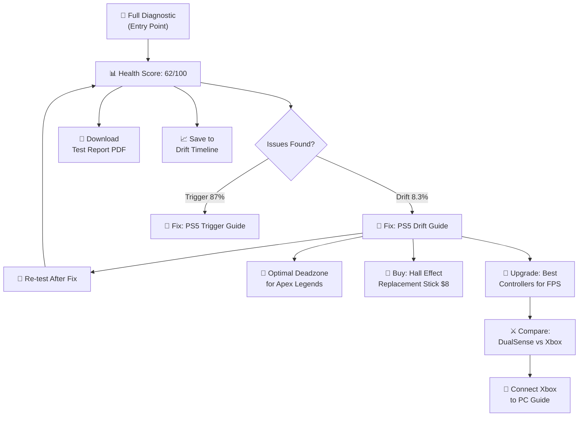

# ⚡ God-Level Strategy: ControllerTesting.com

> [!IMPORTANT]
> This document is the complete architecture for a controller testing platform designed to **outclass all 16+ competitors** with tools they can't easily replicate and SEO they can't catch up to. Every design decision serves two goals: (1) be the best tool, and (2) be unbeatable in Google.

---

## The Core Philosophy: Why This Wins

Every competitor in this space made the same mistake: **they built a tool, not a platform.**

- hardwaretester.com → 1 page, raw data, zero content
- gamepadla.com → database + software, minimal guides
- controllertest.io → clean tools, zero content
- gamepadtester.uk → good data export, zero content

**Your strategy**: Build the tool suite that matches + exceeds every competitor, THEN wrap it in 700+ pages of interconnected SEO content that creates an **information ecosystem** they would need 12+ months to replicate. The tools drive the traffic. The content creates the moat.

---

## Pillar 1: Tool Superiority — 17 Core Interactive Tools

### Table Stakes (What competitors have — you MUST have these)

| # | Tool | What It Does | Competitors Who Have It |
|---|---|---|---|
| 1 | **Button Tester** | Tests all buttons, detects ghosting/double-press | All competitors |
| 2 | **Analog Stick Visualizer** | Real-time X/Y position with trail drawing | All competitors |
| 3 | **Trigger Pressure Tester** | 0–100% analog fill bar for L2/R2 | All competitors |
| 4 | **Stick Circularity Test** | Traces outer edge, calculates circularity % | hardwaretester, gamepadla, controllertest.io |
| 5 | **Vibration/Rumble Tester** | Independent low-freq + high-freq motor test | controllertest.io, gamepadtester.uk, others |
| 6 | **Polling Rate Checker** | Measures controller refresh rate (Hz) | gamepadla, controllertest.io, gamepadtester.uk |
| 7 | **D-Pad Tester** | Directional accuracy test | Most competitors |
| 8 | **Drift Detection** | Measures resting axis values | All competitors |
| 9 | **Deadzone Visualizer** | Shows deadzone area visually | controllertest.io, gamepadtester.uk |
| 10 | **Latency Estimator** | Software-side input timing | gamepadla, controllertest.io |

### Your Advantage (What NO competitor offers — your 7 USPs)

| # | Tool | What It Does | Why It's Hard to Replicate |
|---|---|---|---|
| 11 | **🧭 Full Diagnostic Wizard** | Step-by-step guided test that walks users through EVERY check and generates a final verdict | Requires UX design expertise + integration of all 10 tools into a single guided flow |
| 12 | **📊 Controller Health Score™** | Proprietary 0–100 score combining drift, circularity, button response, trigger range, and vibration motor health into a single number | Becomes a **branded standard** — "My controller scored 73 on ControllerTesting." Branding creates organic backlinks + social shares |
| 13 | **📈 Drift Timeline Tracker** | Uses localStorage to save test results over time. Users return monthly to track degradation: "Your drift went from 1.2% → 3.8% → 9.1% over 8 months" | Creates **habitual return visits** — a retention loop no competitor has. The data stays in the user's browser. |
| 14 | **🎯 Game Settings Optimizer** | Based on YOUR controller's actual drift measurements, auto-recommends optimal deadzone + sensitivity settings for specific games | Requires both the testing tool AND empirical game settings data — a two-sided moat |
| 15 | **📄 Printable Test Report** | Professional PDF/image report of all test results — designed for warranty claims, eBay resale proof, or repair shop submissions | Requires PDF generation, branded templates, and structured data. gamepadtester.uk has CSV export but NOT branded reports |
| 16 | **👥 Community Test Database** | Anonymous aggregated results: "Average DualSense drift after 6 months: 3.2%, after 12 months: 7.8%" | This becomes a **proprietary dataset** that grows over time. Competitors can't get this data without building the same system and waiting months/years |
| 17 | **🔧 Interactive Repair Verifier** | After each repair step in a guide, user re-tests to verify the fix worked: "Before cleaning: 8.3% drift → After cleaning: 2.1% drift ✅" | Integrates content (repair guides) with tools (re-testing). No competitor connects these two |

---

## Pillar 2: Unreplicable Moats — 4 Things Competitors Can't Copy

### Moat 1: Controller Health Score™ (Brand Moat)
```
┌─────────────────────────────────────────────────┐
│          CONTROLLER HEALTH SCORE™               │
│                                                 │
│              ████████████  73/100               │
│                                                 │
│  Stick Drift:    ██████░░░░  Left: 3.2% (OK)   │
│  Circularity:    █████████░  94% (Excellent)    │
│  Buttons:        ██████████  16/16 Working      │
│  Triggers:       ████████░░  L2: 100% R2: 87%  │
│  Vibration:      ██████████  Both motors OK     │
│  Polling Rate:   █████████░  125 Hz (Standard)  │
│                                                 │
│  Verdict: GOOD — Minor R2 trigger wear          │
│  [📄 Download Report]  [🔧 Fix Issues]          │
└─────────────────────────────────────────────────┘
```

When gamers start sharing "My controller got 73 on ControllerTesting," this becomes a **de facto standard** that competitors can't replicate without looking like copycats. It's like how Geekbench owns "benchmark scores" for phones.

### Moat 2: Community Degradation Database (Data Moat)
Over time, anonymous test submissions build a unique dataset:
- "Average DualSense stick drift at 6 months: 3.2%"
- "Average Xbox Elite V2 stick drift at 6 months: 5.8%"
- "DualSense Edge has 47% less drift than standard DualSense at 12 months"

**This data is UNREPLICABLE** — a competitor would need to build the same system, attract the same traffic, and wait 12+ months to accumulate comparable data. It becomes the foundation for authoritative content: "According to 50,000+ user tests on ControllerTesting.com..."

### Moat 3: Drift Timeline (Retention Moat)
localStorage saves test history. Users bookmark and return monthly:
```
📈 Your Left Stick Drift History
Jan 2027:  ▏ 0.8%  (New)
Mar 2027:  ▎ 1.4%  
Jun 2027:  ▍ 2.9%  
Sep 2027:  ▌ 4.7%  ⚠️ Consider cleaning
Dec 2027:  ▋ 8.2%  🔴 Replace recommended
```
This creates **recurring traffic** without email lists or push notifications. No competitor has a retention mechanism.

### Moat 4: Empirical Game Settings (Content × Data Moat)
Settings recommendations LINKED to actual drift data:

> "Based on your **4.2% left stick drift**, we recommend:
> - **Fortnite**: Deadzone 0.08, Look Sensitivity 6
> - **Apex Legends**: Deadzone 0.06 (Per Look), Response Curve Classic
> - **Rocket League**: Deadzone 0.10, Aerial Sensitivity 1.2"

This requires BOTH the testing tool (to measure drift) AND the empirical settings data (to recommend deadzones). No competitor can offer this without building both sides.

---

## Pillar 3: SEO Nuclear Architecture — 700+ Pages

### Site Structure

```
controllertesting.com/
│
├── /                                    # Homepage: Live controller dashboard
│
├── 🔧 /test/                           # TESTING TOOLS HUB (17 pages)
│   ├── /test/full-diagnostic            # ⭐ Flagship guided wizard
│   ├── /test/drift                      # Stick drift detector + scoring
│   ├── /test/buttons                    # Button tester + ghosting check
│   ├── /test/triggers                   # Trigger pressure + range test
│   ├── /test/vibration                  # Dual motor rumble test
│   ├── /test/circularity                # Stick circularity analysis
│   ├── /test/deadzone                   # Deadzone visualizer + configurator
│   ├── /test/polling-rate               # Hz measurement
│   ├── /test/latency                    # Input timing estimator
│   ├── /test/dpad                       # D-Pad accuracy test
│   ├── /test/gyroscope                  # Motion sensor test (WebHID)
│   ├── /test/touchpad                   # PS touchpad test (WebHID)
│   ├── /test/microphone                 # DualSense mic test
│   ├── /test/multi-controller           # Test 2-4 controllers at once
│   ├── /test/health-score               # Overall health score generator
│   ├── /test/timeline                   # Drift timeline tracker
│   └── /test/report                     # Downloadable PDF report
│
├── 🎮 /controllers/                     # CONTROLLER PROFILES (35+ pages)
│   ├── /controllers/ps5-dualsense
│   ├── /controllers/ps5-dualsense-edge
│   ├── /controllers/ps4-dualshock-4
│   ├── /controllers/xbox-series-x-s
│   ├── /controllers/xbox-elite-series-2
│   ├── /controllers/xbox-one
│   ├── /controllers/switch-pro
│   ├── /controllers/joy-con
│   ├── /controllers/steam-deck
│   ├── /controllers/scuf-reflex
│   ├── /controllers/scuf-instinct
│   ├── /controllers/razer-wolverine-v2
│   ├── /controllers/8bitdo-pro-2
│   ├── /controllers/8bitdo-ultimate
│   ├── /controllers/logitech-f710
│   ├── /controllers/hori-fighting-commander
│   ├── /controllers/powera-enhanced
│   ├── /controllers/backbone-one
│   ├── /controllers/gamecube                # Smash Bros community
│   └── ... (35+ total)
│   │
│   └── Each page includes:
│       - Custom visual layout matching the controller
│       - Known issues (e.g., "DualSense drift typically starts after 400 hours")
│       - Community Health Score average from test database
│       - Direct "Test This Controller" button → opens tool with correct mapping
│       - Repair guides links for common issues
│       - Where to buy (affiliate links)
│       - Specifications table (weight, battery, connectivity, features)
│
├── 🔧 /fix/                             # REPAIR & TROUBLESHOOTING (60+ pages)
│   ├── /fix/stick-drift/                 # Drift fixes by controller
│   │   ├── /fix/stick-drift/ps5-dualsense
│   │   ├── /fix/stick-drift/xbox-elite-v2
│   │   ├── /fix/stick-drift/joy-con
│   │   └── ... (15+ controllers × drift fix)
│   ├── /fix/not-connecting/              # Connection issues
│   │   ├── /fix/not-connecting/ps5-dualsense-pc
│   │   ├── /fix/not-connecting/xbox-bluetooth
│   │   └── ... (20+ connection guides)
│   ├── /fix/trigger-issues/              # Trigger problems
│   ├── /fix/button-stuck/                # Button problems
│   ├── /fix/vibration-not-working/       # Motor issues
│   └── /fix/cleaning-guide/             # General cleaning guides
│   │
│   └── Each repair page includes:
│       - Step-by-step numbered instructions (HowTo schema)
│       - ⭐ Embedded "re-test" button after each step (Interactive Repair Verifier)
│       - Parts & tools needed with affiliate links
│       - Difficulty rating (Easy / Medium / Hard)
│       - Estimated time
│       - Video embed placeholder
│       - "Still broken? Upgrade" CTA with affiliate controller recommendations
│
├── 🎯 /settings/                         # GAME-SPECIFIC SETTINGS (100+ pages)
│   ├── /settings/fortnite/
│   │   ├── /settings/fortnite/ps5
│   │   ├── /settings/fortnite/xbox
│   │   └── /settings/fortnite/general
│   ├── /settings/apex-legends/
│   ├── /settings/rocket-league/
│   ├── /settings/call-of-duty/
│   ├── /settings/valorant/
│   ├── /settings/overwatch-2/
│   ├── /settings/fifa-fc/
│   ├── /settings/elden-ring/
│   ├── /settings/gta-6/
│   ├── /settings/halo-infinite/
│   └── ... (50+ games × 2-3 controller variants each)
│   │
│   └── Each settings page includes:
│       - Recommended deadzone based on drift level (linked to tester)
│       - Pro player settings comparison table
│       - Sensitivity recommendations
│       - Button layout options
│       - "Test your controller first" CTA → link to drift tester
│
├── ⚔️ /compare/                          # CONTROLLER COMPARISONS (80+ pages)
│   ├── /compare/ps5-dualsense-vs-xbox-series
│   ├── /compare/xbox-elite-v2-vs-scuf-reflex
│   ├── /compare/dualsense-vs-dualsense-edge
│   ├── /compare/8bitdo-ultimate-vs-xbox-elite
│   └── ... (80+ head-to-head matchups)
│   │
│   └── Each comparison includes:
│       - Side-by-side specs table (Product schema)
│       - Community Health Score comparison (from your database)
│       - Average drift at 6/12 months (from your database)
│       - Price comparison
│       - Pros/cons for each
│       - "Best for [use case]" verdict
│       - Affiliate buy links
│
├── 🔌 /connect/                          # CONNECTION GUIDES (80+ pages)
│   ├── /connect/ps5-dualsense/windows-11
│   ├── /connect/ps5-dualsense/mac
│   ├── /connect/ps5-dualsense/iphone
│   ├── /connect/ps5-dualsense/android
│   ├── /connect/ps5-dualsense/steam-deck
│   ├── /connect/xbox/windows-11
│   ├── /connect/xbox/mac
│   ├── /connect/switch-pro/windows
│   └── ... (20 controllers × 4-5 platforms each)
│
├── 🏆 /best/                             # BUYING GUIDES (30+ pages)
│   ├── /best/controllers-for-pc
│   ├── /best/controllers-under-50
│   ├── /best/controllers-under-100
│   ├── /best/hall-effect-controllers      # Anti-drift technology
│   ├── /best/controllers-for-fps
│   ├── /best/controllers-for-racing
│   ├── /best/controllers-for-fighting-games
│   ├── /best/controllers-for-kids
│   ├── /best/wireless-controllers
│   ├── /best/controllers-for-big-hands
│   ├── /best/controllers-for-small-hands
│   ├── /best/controllers-for-accessibility
│   └── ... (30+ buying guides)
│
├── 📊 /data/                             # COMMUNITY DATA (10+ pages)
│   ├── /data/drift-rankings               # Which controllers drift most/least
│   ├── /data/durability-rankings           # Longevity rankings
│   ├── /data/health-score-averages         # Average scores by model
│   ├── /data/polling-rate-comparison       # Measured polling rates
│   └── /data/monthly-report               # Monthly community stats
│
└── 📚 /learn/                            # EDUCATIONAL CONTENT (20+ pages)
    ├── /learn/what-is-stick-drift
    ├── /learn/what-is-polling-rate
    ├── /learn/what-is-deadzone
    ├── /learn/what-is-input-lag
    ├── /learn/hall-effect-vs-potentiometer
    ├── /learn/how-controllers-work
    ├── /learn/controller-buying-guide
    └── ... (20+ educational articles)
```

### Total Page Count

| Section | Pages | Type |
|---|---|---|
| Testing Tools | 17 | Interactive tools |
| Controller Profiles | 35+ | Reference + data |
| Repair Guides | 60+ | How-to content |
| Game Settings | 100+ | Programmatic |
| Comparisons | 80+ | Programmatic |
| Connection Guides | 80+ | Programmatic |
| Buying Guides | 30+ | Affiliate content |
| Community Data | 10+ | Data-driven |
| Educational Content | 20+ | Authority content |
| **TOTAL** | **432–700+** | — |

> [!IMPORTANT]
> Every competitor has **< 30 indexed pages**. You will launch with **100+ pages in Phase 1** and scale to **700+**. This is the single biggest structural advantage and it's extremely hard to catch up to.

---

## Pillar 4: Internal Linking — The SEO Flywheel

The magic is in how every page links to every other relevant page, creating a web Google can't ignore:



**Every user journey creates 3-5 internal link clicks.** This is gold for:
- **Time on site** (engagement signal)
- **Pages per session** (ad impressions)
- **Internal link equity** (SEO juice flows throughout the site)

---

## Pillar 5: Schema Markup — Featured Snippet Domination

### Every page type gets specific structured data:

| Page Type | Schema | Featured Snippet Target |
|---|---|---|
| Testing tools | `SoftwareApplication` + `WebApplication` | "gamepad tester online" → tool card |
| Repair guides | `HowTo` with `Step` objects | "how to fix PS5 controller drift" → numbered steps |
| Controller profiles | `Product` with specs | "PS5 DualSense specs" → specs table |
| Comparisons | `Product` comparison table | "DualSense vs Xbox controller" → comparison table |
| Game settings | `Table` + `FAQ` | "best Fortnite deadzone settings" → settings table |
| Buying guides | `ItemList` + `Product` | "best controllers for PC" → product list |
| Educational | `Article` + `FAQ` | "what is stick drift" → definition box |

### FAQ Schema on Every Page
Each page includes 3-5 FAQs with `FAQPage` schema:
- Tool pages: "How do I test my controller for drift?", "Is this test accurate?"
- Repair pages: "Can I fix stick drift without opening my controller?", "How much does it cost to fix?"
- Settings pages: "What deadzone should I use?", "Do pro players use deadzone?"

This maximizes **SERP real estate** — your result shows expandable FAQ snippets that push competitors down.

---

## Pillar 6: Phased Execution Plan

### Phase 1: Launch & Capture Easy Wins (Month 1-2)
**Build:**
- 17 core testing tools (all interactive, client-side)
- Controller Health Score algorithm
- Full Diagnostic Wizard
- 15 controller profile pages (top controllers only)
- 10 highest-priority repair guides (stick drift for top 5 controllers)
- Printable test report (PDF generation)

**SEO targets (EASY keywords):**
- `PS5 controller test online` — no dedicated PS5 page exists anywhere
- `Xbox controller drift test` — Reddit ranks for this
- `Joy-Con drift test` — weak SERP
- `is my controller broken test` — nobody answers this
- `controller health test` — brand new keyword you CREATE
- `how to fix [controller] stick drift` — iFixit/Reddit dominate but no tool integration

**Estimated pages: ~45**

### Phase 2: Content Moat (Month 3-5)
**Build:**
- Remaining 20+ controller profiles
- 50+ repair/troubleshooting guides
- 30+ game settings pages (top competitive games)
- 20+ connection guides
- 10+ educational articles
- Community test database (start collecting anonymous data)
- Drift Timeline feature

**SEO targets (MEDIUM keywords):**
- `controller drift test` — now have enough authority
- `deadzone tester` — best visualizer + configurator
- `controller vibration test` — superior UX
- `best controller settings for [game]` — 30+ pages targeting this
- `[controller A] vs [controller B]` — comparison pages

**Estimated pages: ~175 (cumulative ~220)**

### Phase 3: Scale & Dominate (Month 6-12)
**Build:**
- 50+ more comparison pages
- 50+ more connection guides
- 50+ more game settings pages (expand to casual/indie games)
- 20+ buying guides
- Community data reports and rankings
- Monthly refresh of all content

**SEO targets (HARD keywords):**
- `gamepad tester` — now competing with hardwaretester.com with 700+ page authority
- `controller test online` — same
- `test my controller` — same

**Estimated pages: ~700+ (cumulative)**

---

## Why This Is Nearly Impossible to Replicate

| Your Advantage | Time for Competitor to Replicate |
|---|---|
| 17 interactive tools | 2-3 months |
| Controller Health Score™ branding | Can't copy without looking derivative |
| 700+ interconnected pages | 6-12 months minimum |
| Community test database | 12+ months (need traffic first to collect data) |
| Drift Timeline retention loop | Need the brand trust first |
| Game Settings Optimizer (linked to drift data) | Need both tool AND settings data |
| Internal linking graph (432+ pages cross-linked) | Architectural effort of 6+ months |
| Featured snippets from schema markup | Need content authority first |
| Backlinks from gaming communities | Earned over months of being useful |

> [!TIP]
> **The compound effect**: Each moat strengthens the others. More users → more community data → better recommendations → more trust → more users. This is a **flywheel** that accelerates over time while competitors face a cold start problem.

---

## Monetization Architecture

### Revenue Stream 1: Contextual Affiliate Funnel (Primary)
```
Test fails (drift detected)
├── "Fix it yourself" → iFixit repair kit ($8-25, ~5-7% commission)
├── "Quick fix" → Contact cleaner spray ($5-10, Amazon)
├── "Upgrade" → Recommended controllers ($60-250, Razer 10-15%)
└── "Hall Effect upgrade" → Drift-proof controllers ($40-80, 8BitDo/GuliKit)

Test passes (healthy controller)  
├── "Protect it" → Controller grip/case ($15-30, Amazon)
├── "Optimize it" → Game settings page → game affiliate
└── "Compare it" → Comparison page → affiliate CTA
```

### Revenue Stream 2: Display Advertising
- **Phase 1** (< 50K sessions): Google AdSense
- **Phase 2** (50K+ sessions): Mediavine or Raptive ($15-30+ RPM for gaming)
- **Phase 3**: Direct sponsorships from controller brands

### Revenue Stream 3: Data Products (Future)
- "Controller Durability Report 2027" — annual report based on community data
- API access for gaming publications wanting to cite your data
- Sponsored controller reviews with empirical test data

---

## Quick-Reference: Your USPs vs Every Competitor

```
                    hardwaretester  gamepadla  controllertest.io  gamepadtester.uk  YOU
                    ─────────────  ─────────  ─────────────────  ────────────────  ───
Tools count              4           5+            6+                 5+           17
Indexed pages           ~5          ~25           ~5                 ~5          700+
Health Score             ❌          ❌            ❌                 ❌           ✅
Guided Wizard            ❌          ❌            ❌                 ❌           ✅
Drift Timeline           ❌          ❌            ❌                 ❌           ✅
Game Settings            ❌          ❌            ❌                 ❌          100+
Repair Guides            ❌          ❌            ❌                 ❌           60+
Comparisons              ❌         Some           ❌                 ❌           80+
Community Data           ❌          ❌            ❌               Leaderboard    ✅
Affiliate Funnel         ❌          ❌            ❌                 ❌           ✅
PDF Report               ❌          ❌            ❌              CSV/JSON/PDF    ✅ Branded
Schema Markup         Minimal     Minimal       Minimal            Minimal     Full Stack
```

> [!NOTE]
> **The key insight**: Competitors are fighting over who has the better *tool*. You're building a *platform*. It's like comparing a calculator app to Wolfram Alpha — same input, completely different value proposition.
