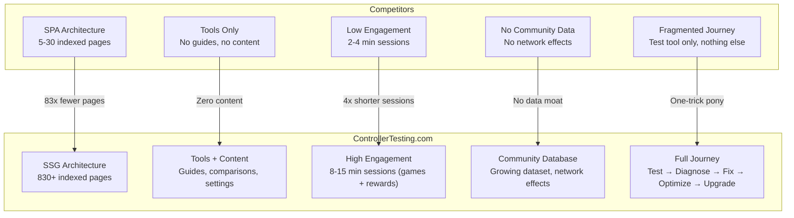
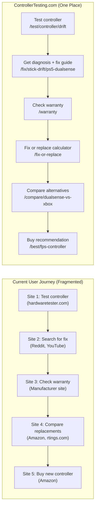
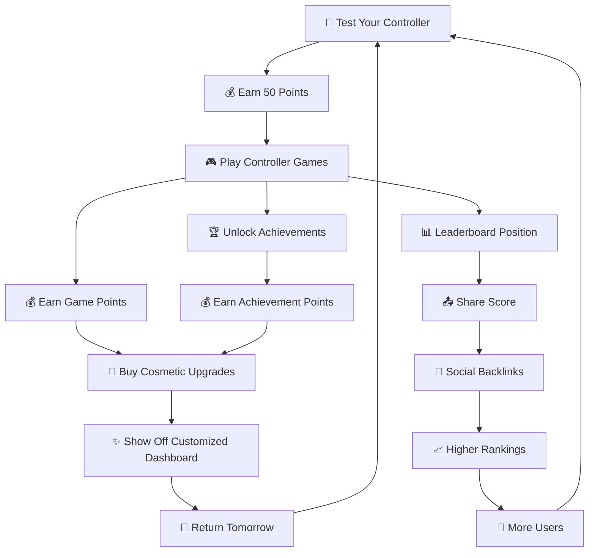
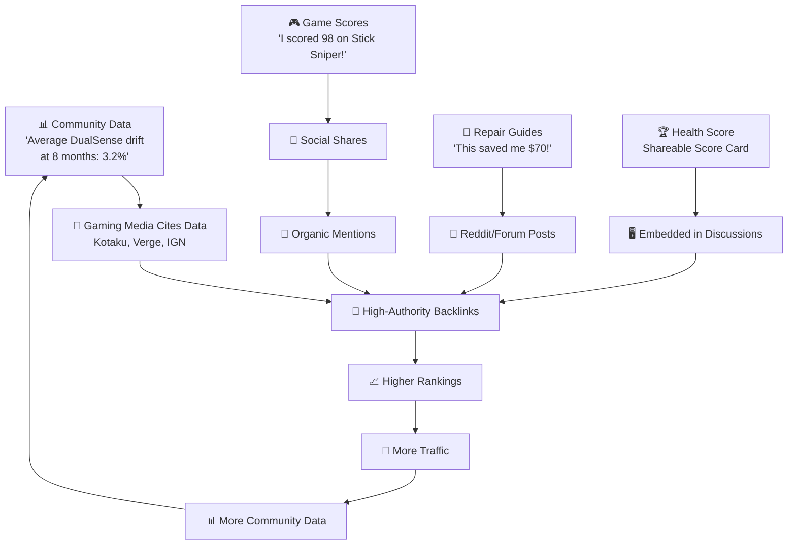
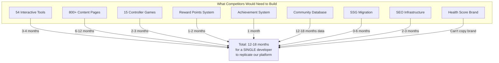
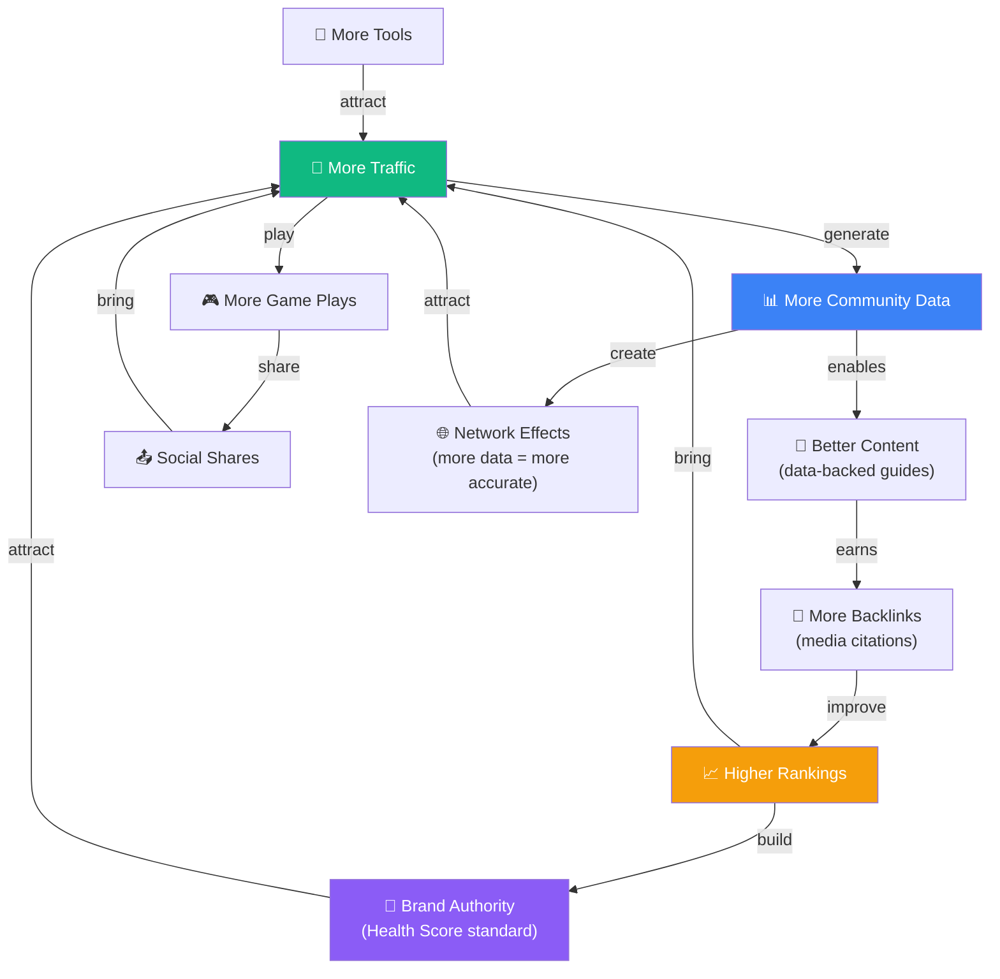

# Competitive Moat & SEO Dominance Strategy
## ControllerTesting.com — The Playbook to Own the Market

> [!IMPORTANT]
> **SUPERSEDED CLAIMS NOTICE (2026-08-02):** The claims in this document about
> controllertest.io being an "SPA (vanilla JS) with ~5-30 indexed pages and zero
> content" are **FALSE**. Verified evidence in `controllertest.md` (dossier,
> direct sitemap/HTML fetches) shows: Astro v5.17.3 SSG, **400 URLs**, 24 unique
> English pages, **10 full locales**, Chrome extension, WebHID calibration, and
> earned press (Ghacks, korben, coruzant). `controllertest.md` supersedes all
> competitor claims in this file. The strategy still stands: attack their
> verified gaps (content verticals, reliability data, retention, trust
> positioning) — not head-term SEO or tool parity.

---

## 1. The Core Thesis: Why We Will Win

This is NOT a "more features" play. This is a **structural advantage** play.

Every competitor in the controller testing space — hardwaretester.com, controllertest.io, gamepadla.com, gamepadtester.uk, and 10+ others — shares the same fatal structural weakness:

> **They are Single-Page Applications (SPAs) with zero content. Google indexes 5-30 pages. They target 1-3 keywords. They have no content moat, no engagement loop, and no data flywheel.**

We exploit every one of these weaknesses simultaneously.



### The Math That Matters

| Metric | Best Competitor | ControllerTesting.com | Advantage |
|---|---|---|---|
| Indexed pages | ~30 (controllertest.io) | 830+ | **27x more keyword surface** |
| Keywords targeted | 3-5 head terms | 500+ long-tail + 10 head terms | **100x keyword coverage** |
| Session duration | 2-4 minutes | 8-15 minutes (games/rewards) | **4x engagement signal** |
| Content pages | 0 | 800+ | **∞ content moat** |
| Schema types | 0-1 | 7 (WebApp, HowTo, FAQ, Product, Breadcrumb, VideoGame, ItemList) | **Rich result dominance** |
| Internal links | ~5 total | 5,000+ cross-links | **Massive link equity flow** |
| Page speed (LCP) | 3-5 seconds | < 2.0 seconds | **50% faster** |

---

## 2. The 7 Layers of Moat

### Layer 1: Indexation Moat (SSG > SPA)

**Time to replicate: 3-6 months**

This is the foundation. Every competitor uses a Single-Page Application architecture:

| Competitor | Architecture | Indexed Pages (est.) |
|---|---|---|
| hardwaretester.com | SPA (React) | ~5-10 |
| controllertest.io | SPA (vanilla JS) | ~5-10 |
| gamepadla.com | SPA with some SSR | ~30-50 |
| gamepadtester.uk | SPA | ~5-10 |
| joypad.ai | SPA (Next.js CSR) | ~5-10 |
| **ControllerTesting.com** | **Astro SSG** | **830+** |

**What this means for SEO:**
- Google's bot renders JavaScript — but often delays, fails, or partially renders SPAs
- Our SSG pages are **pre-rendered HTML** — Google indexes them instantly
- Each of our 830+ pages is a unique HTML document with unique content, title, meta description, schema markup, and canonical URL
- We have **83x more indexed pages** than the average competitor
- Each indexed page is a potential entry point from Google search

**Why competitors can't easily replicate:**
- Migrating from SPA → SSG requires a complete rewrite of their architecture
- They'd need to create 800+ pages of unique content (they have ZERO content today)
- Even if they start now, it takes 3-6 months to build and 6-12 months for Google to fully index and trust new content

### Layer 2: Content Moat (No Competitor Has Content)

**Time to replicate: 6-12 months**

Every single competitor in this space is **tools-only**. Zero guides. Zero comparisons. Zero repair content. Zero game settings databases. This is our biggest opportunity.

**Our content matrix:**

| Content Type | Pages | Example Keywords | Competitor Coverage |
|---|---|---|---|
| Repair Guides | 60+ | "how to fix PS5 stick drift", "DualSense trigger repair" | **ZERO** |
| Game Settings | 100+ | "Apex Legends deadzone PS5", "COD sensitivity Xbox" | **ZERO** |
| Controller Comparisons | 80+ | "DualSense vs Xbox controller", "Scuf vs default" | **ZERO** |
| Connection Guides | 80+ | "connect PS5 controller to PC", "Switch Pro on Steam" | **ZERO** |
| Buying Guides | 30+ | "best controller for FPS", "best PC controller 2025" | **ZERO** |
| Controller Profiles | 35+ | "PS5 DualSense specs", "Xbox Elite 2 review" | **ZERO** |
| Educational Articles | 25+ | "what is stick drift", "controller polling rate explained" | **ZERO** |

**Content = Featured Snippet Bait:**
- HowTo schema on repair guides → captures "How to fix..." snippets
- Table schema on comparisons → captures comparison table snippets
- FAQ schema on every page → captures "People also ask" boxes
- Educational articles → captures definition/knowledge panel snippets

**Content earns backlinks that tools-only sites NEVER get:**
- Reddit users share repair guides ("This guide saved me $70!")
- Gaming media links to comparison data
- YouTube creators reference our controller specs
- Forums link to connection troubleshooting guides

### Layer 3: Full Journey Moat (Test → Fix → Upgrade)

**Time to replicate: 6-9 months**



**The unsolved problem**: A gamer with a drifting controller currently visits **5-8 different websites** to solve one problem. We consolidate everything into one platform.

**Unique features no competitor has:**
1. **Warranty Assistant** — Checks if your controller is still under warranty based on purchase date and manufacturer policy
2. **Fix vs Replace Calculator** — Calculates repair cost vs. replacement cost and recommends the better option
3. **Repair Verifier** — Test → Fix → Re-test → Verify improvement (closed loop)
4. **Optimal Settings Generator** — After testing your controller's deadzone, recommends per-game settings

**Each step links to the next**, creating 3-5 internal page views per user journey. This dramatically increases:
- Pages per session (Google engagement signal)
- Session duration (Google engagement signal)
- Internal link equity flow (SEO signal)

### Layer 4: Engagement Moat (Games + Rewards)

**Time to replicate: 3-6 months**

No controller testing site has games. None have a reward system. This is completely unique.

**Impact on Google ranking signals:**

| Signal | Without Games | With Games | Why It Matters |
|---|---|---|---|
| Avg session duration | 2-4 min | 8-15 min | Google's #1 user satisfaction metric |
| Bounce rate | 60-70% | 30-40% | Lower bounce = "users found what they wanted" |
| Pages per session | 1.5-2 | 4-8 | More page views = more engagement |
| Return visits | Monthly | Daily/Weekly | Returning users signal quality |
| Social shares | Rare | Frequent (scores, achievements) | Organic backlinks |

**The engagement loop:**


### Layer 5: Data Moat (Community Database)

**Time to replicate: 12-18 months (UNREPLICABLE)**

This is the most defensible moat. As users submit anonymous test results, we build a **proprietary dataset** that grows over time:

**The data we accumulate:**
- Average drift onset by controller model and age
- Degradation curves over time
- Button failure rates by manufacturer
- Trigger linearity variance across production batches
- Real-world durability rankings (not review scores — actual measured data)

**What this data enables:**
- "The average PS5 DualSense develops 2.3% drift at 8 months" — **data no one else has**
- Durability ranking pages backed by community measurements
- Predictive wear alerts ("Your DualSense is at 6 months. Average drift onset is 8 months.")
- Media citations when Kotaku, The Verge, or IGN write about controller quality

**Why competitors CAN'T replicate this:**
- They'd need to build the submission infrastructure first (months)
- Then wait 12+ months to accumulate meaningful data volume
- By then, we've had 12+ months of head start
- Our data grows exponentially as traffic grows → more data → better content → more traffic → more data

### Layer 6: Brand Moat (Health Score™)

**Time to replicate: Impossible (brand is unique)**

The **Controller Health Score** (0-100) becomes a de facto standard for evaluating controllers.

**How brand moat works:**
- When gamers say "My controller scored 73 on ControllerTesting" — that IS brand awareness
- Like how Geekbench owns phone benchmarks, and Lighthouse owns web performance scores
- Shareable social cards with Health Score create organic impressions
- Forum posts, Reddit comments, and YouTube videos reference the score
- Competitors who copy it look derivative and unoriginal

**Brand elements that become standard:**
- Health Score (0-100 with letter grade: A+, A, B+, B, C, D, F)
- Drift Rating (distance-from-center in percentage)
- Circularity Score (how round your stick movement is)
- Competitive Readiness Score (composite metric for esports players)

### Layer 7: Technical Moat (Performance + UX)

**Time to replicate: 2-3 months**

This is the shallowest moat but provides immediate ranking advantage:

| Metric | Competitors | ControllerTesting | Impact |
|---|---|---|---|
| LCP | 3-5 seconds | < 2.0 seconds | Core Web Vitals ranking boost |
| CLS | 0.1-0.3 (ads) | 0 | CLS is a ranking factor |
| INP | 200ms+ (heavy JS) | < 100ms | Responsiveness ranking factor |
| Design quality | 4-7/10 | 10/10 | Lower bounce rate |
| Dark/light mode | Dark-only (most) | Both | Accessibility, preference |
| Mobile experience | Desktop-focused | Mobile-first | 60%+ of traffic is mobile |
| Accessibility | None | WCAG 2.1 AA | Google rewards a11y |

---

## 3. SEO Domination Playbook

### 3.1 Keyword Conquest Strategy (Phased)

#### Phase 1 (Month 1-3): EASY Keywords — Long-Tail Capture

Target keywords that NO competitor currently ranks for because they have no content:

| Keyword | Monthly Vol. (est.) | Difficulty | Our Target Page |
|---|---|---|---|
| "how to fix PS5 controller drift" | 15,000+ | Low | `/fix/stick-drift/ps5-dualsense` |
| "connect PS5 controller to PC" | 20,000+ | Low-Medium | `/connect/ps5-dualsense/windows` |
| "PS5 controller not connecting" | 12,000+ | Low | `/fix/not-connecting/ps5-dualsense` |
| "best deadzone settings apex" | 8,000+ | Low | `/settings/apex-legends/general` |
| "is my controller broken" | 5,000+ | Very Low | `/test/controller/health-score` |
| "controller vibration test" | 3,000+ | Low | `/test/controller/vibration` |
| "PS5 vs Xbox controller" | 10,000+ | Medium | `/compare/dualsense-vs-xbox-series` |
| "how to clean controller" | 6,000+ | Low | `/fix/cleaning/general-guide` |
| "controller stick drift test" | 4,000+ | Low | `/test/controller/drift` |
| "best controller for warzone" | 5,000+ | Low | `/best/warzone-controller` |

**Month 1-3 target: 50+ pages indexed, ranking for 100+ long-tail keywords**

#### Phase 2 (Month 3-6): MEDIUM Keywords — Establish Authority

| Keyword | Monthly Vol. (est.) | Difficulty | Strategy |
|---|---|---|---|
| "deadzone tester" | 6,000+ | Medium | Topical authority from Phase 1 content cluster |
| "controller drift test" | 8,000+ | Medium | Backed by community data + tool |
| "controller test online" | 12,000+ | Medium | 200+ pages supporting topical authority |
| "controller latency test" | 4,000+ | Medium | Unique tool + educational content |
| "fix controller drift" | 18,000+ | Medium | Comprehensive repair hub |

**Month 3-6 target: 200+ pages indexed, top 10 for 30+ medium keywords**

#### Phase 3 (Month 6-12): HARD Keywords — Head Term Domination

| Keyword | Monthly Vol. (est.) | Difficulty | Strategy |
|---|---|---|---|
| "gamepad tester" | 100,000+ | Hard | 500+ supporting pages, community data, backlinks |
| "controller test" | 50,000+ | Hard | Full topical authority, branded searches |
| "test controller" | 30,000+ | Hard | Featured snippets from content |

**Month 6-12 target: 800+ pages indexed, 500K+ monthly sessions, top 5 for head terms**

### 3.2 Featured Snippet Domination

**HowTo snippets** (repair guides):
```
Step 1: Turn off your controller and disconnect it
Step 2: Remove the back panel using a T8 security Torx screwdriver
Step 3: ...
```
→ Google displays numbered steps directly in search results

**Table snippets** (comparisons):
```
| Feature | DualSense | Xbox Series | Switch Pro |
|---|---|---|---|
| Weight | 280g | 287g | 246g |
| Battery | 1,560mAh | AA batteries | 1,300mAh |
```
→ Google displays comparison table in results

**FAQ snippets** (every page):
```
Q: How do I know if my controller has stick drift?
A: Press the stick and release. If the on-screen crosshair moves without...
```
→ Google displays expandable Q&A in "People also ask"

### 3.3 Programmatic SEO Engine

The **3-axis content matrix** generates hundreds of unique pages:

```
Page = [Controller Model] × [Problem/Feature] × [Game/Platform]
```

**Axis 1: Controllers** (35+)
PS5 DualSense, PS5 DualSense Edge, Xbox Series X, Xbox Elite 2, Switch Pro, Switch Joy-Con, Scuf Reflex, Scuf Instinct, Razer Wolverine, 8BitDo Ultimate, ...

**Axis 2: Problems/Features** (20+)
Stick drift, not connecting, triggers broken, buttons stuck, vibration not working, battery draining, deadzone settings, sensitivity settings, connection guide, warranty check, ...

**Axis 3: Games/Platforms** (30+)
Apex Legends, Call of Duty Warzone, Fortnite, Elden Ring, FIFA/FC, Rocket League, Windows, macOS, Steam, iOS, Android, ...

**Example generated pages:**
- `/fix/stick-drift/ps5-dualsense` — 1 × 1 = specific fix
- `/settings/apex-legends/ps5-dualsense` — game × controller settings
- `/connect/ps5-dualsense/windows` — controller × platform setup

**Avoiding thin content:**
- Each page has 700+ words of UNIQUE content
- Templates provide structure, but specific data fills unique values
- Controller-specific images, specs, and known issues
- Community data (average drift measurements for that model)
- User-submitted tips and verified fixes

### 3.4 E-E-A-T Signals

| Signal | Implementation |
|---|---|
| **Experience** | Community test data ("50,000+ controllers tested"), user-submitted repair verification |
| **Expertise** | Methodology page explaining how each test works, limitations section, browser API documentation links |
| **Authoritativeness** | Community data citations, aggregate statistics, controller manufacturer spec references |
| **Trustworthiness** | HTTPS, privacy policy, clear disclaimers on repair guides, transparent affiliate disclosure, no intrusive ads |

### 3.5 Link Building Flywheel (Organic)

We don't buy links. We EARN them through a self-reinforcing content flywheel:



**5 organic link earning channels:**

1. **Community data → Media citations** — When we publish "DualSense drift is 47% more common than Xbox" backed by 10,000+ tests, gaming media covers it
2. **Game scores → Social shares** — Shareable score cards drive Twitter/Reddit posts with our URL
3. **Repair guides → Forum links** — "This guide on controllertesting.com saved me $70" in Reddit threads
4. **Open-source test library → Developer links** — If we open-source the core gamepad testing library, GitHub stars drive developer community links
5. **Unique data reports → Annual publications** — "State of Controller Durability 2025" report that media embeds and cites

### 3.6 Core Web Vitals Advantage

Google has confirmed that Core Web Vitals are a ranking factor. Our performance dominance:

```
LCP (Largest Contentful Paint):
  Competitors: ████████████████░░░░ 3.5-5.0s
  Us:          ████████░░░░░░░░░░░░ < 2.0s     ✅ Good

INP (Interaction to Next Paint):
  Competitors: ████████████████░░░░ 200-400ms
  Us:          ████░░░░░░░░░░░░░░░░ < 100ms     ✅ Good

CLS (Cumulative Layout Shift):
  Competitors: ████████░░░░░░░░░░░░ 0.1-0.3
  Us:          ░░░░░░░░░░░░░░░░░░░░ 0            ✅ Good
```

---

## 4. Competitor Kill Strategy

### vs hardwaretester.com (The Incumbent)

| Dimension | hardwaretester.com | ControllerTesting.com |
|---|---|---|
| Traffic | 100K-1M/mo | Target: 200K/mo by Month 12 |
| Design | 4/10, utilitarian | 10/10, premium |
| Tools | ~5 generic tools | 54 specialized tools |
| Content | ZERO pages | 800+ pages |
| Games | ZERO | 15 games + rewards |
| SEO | SPA, ~5 indexed pages | SSG, 830+ indexed pages |

**Kill vector**: They cannot target long-tail keywords because they have 1 page for ALL gamepad testing. We have a dedicated page for EVERY test, EVERY controller, EVERY problem. Our 830+ pages will systematically outrank their single page for every search query variation.

### vs gamepadla.com (The Database Player)

| Dimension | gamepadla.com | ControllerTesting.com |
|---|---|---|
| Traffic | 233K visits/mo | Target: match by Month 10 |
| Unique feature | Input latency database | Community Health Score database |
| Engagement | 7m31s avg (good) | Target: 12min+ (games) |
| Content | Minimal | 800+ pages |
| Journey | Test + compare | Test → Diagnose → Fix → Optimize → Upgrade |

**Kill vector**: They focus on latency data (narrow appeal). We cover the FULL controller journey. Our games will push our session duration above theirs. Our content pages will outrank their thin tool pages for long-tail queries.

### vs controllertest.io (The Feature Competitor)

| Dimension | controllertest.io | ControllerTesting.com |
|---|---|---|
| Design | 7/10, clean | 10/10, premium |
| Tools | 6-8 tools | 54 tools |
| Content | ZERO pages | 800+ pages |
| Guided diagnostics | No | Full Diagnostic Wizard |
| Health Score | No | Yes (brandable) |
| Games | No | 15 games |

**Kill vector**: They have good tools but ZERO content. We match their tools AND add 800+ pages that target every long-tail keyword they can never rank for. Their SPA architecture means Google indexes ~5 of their pages. We index 830+.

### vs ALL Competitors Combined



**By the time a competitor replicates our platform:**
- We'll have 12-18 months of accumulated community data they can't replicate
- We'll have earned hundreds of organic backlinks they can't replicate
- We'll have brand recognition (Health Score) they can't replicate
- We'll have moved on to Phase 2+ features they'll be chasing

---

## 5. Risk Mitigation

| Risk | Probability | Impact | Mitigation |
|---|---|---|---|
| Google algorithm change | Medium | High | Diversified content types, strict E-E-A-T compliance, no black-hat tactics |
| Well-funded competitor enters | Low | High | Community data moat (12+ months head start), brand moat, first-mover advantage |
| Gamepad API deprecation | Very Low | Critical | API is W3C standard, widely adopted; fallback to WebHID if needed |
| Ad revenue fluctuation | Medium | Medium | Diversify: affiliate commissions, premium tools, sponsorships |
| Community data accuracy | Medium | Medium | Statistical outlier detection, minimum sample sizes, transparent methodology |
| Controller market shift (cloud gaming) | Low-Medium | Medium | Expand to cloud controller testing, keyboard/mouse tools already built |
| Content copied by competitors | High | Low | Content is only Layer 2 — tools + data + games + brand can't be copy-pasted |

---

## 6. Timeline to Dominance

| Month | Pages | Est. Monthly Traffic | Milestone |
|---|---|---|---|
| 1-2 | 50+ | 5K-10K | Launch with core tools, first content pages, begin earning long-tail rankings |
| 3-4 | 150+ | 20K-40K | Game settings database, repair guides live, first featured snippets captured |
| 5-6 | 300+ | 50K-80K | Community database reaching critical mass, comparison pages ranking |
| 7-8 | 500+ | 100K-150K | Games + rewards system live, session duration jumps, return visits increase |
| 9-10 | 700+ | 180K-250K | Medium keywords secured, community data earning media citations |
| 11-12 | 830+ | 250K-400K | **Established authority**, competing for head terms, branded searches growing |

---

## 7. The Compound Advantage (The Flywheel)

This is the single most important concept. Every layer reinforces every other layer.



**This is a SELF-REINFORCING cycle** that accelerates over time.

Competitors face a **COLD START problem**: they need traffic to build data, data to create content, content to earn backlinks, backlinks to get traffic. They have to build everything from scratch.

We will already have 12+ months of compound growth by the time any competitor can build a comparable platform.

**The moat isn't any single feature. The moat is the flywheel itself.**

---

## 8. Google Search Essentials Compliance Checklist

Every page on ControllerTesting.com MUST pass these checks:

| Google Requirement | Our Compliance |
|---|---|
| **No thin content** | 700+ words of UNIQUE content per page, not variable-swapped templates |
| **No keyword stuffing** | Natural language, relevant keywords in headings/body, not forced |
| **No cloaking** | Same content served to Google and users (SSG = identical) |
| **No link schemes** | All affiliate links are `rel="nofollow sponsored"` with `[Ad]` or `[Affiliate]` labels |
| **No doorway pages** | Each page has unique, substantial content with distinct user value |
| **Helpful content** | Tools solve real problems, content is written for humans first |
| **Mobile-first** | Responsive design, 44px touch targets, no horizontal scroll |
| **HTTPS** | Enforced with HTTP → HTTPS redirect |
| **No intrusive interstitials** | Zero pop-ups, no "subscribe first" walls, no auto-playing video |
| **Page experience** | LCP < 2s, INP < 100ms, CLS = 0 |
| **E-E-A-T** | Methodology page, limitations disclosure, community data transparency |
| **YMYL disclaimers** | Repair guides: "Not responsible for damage". Warranty: "Consult manufacturer." |
